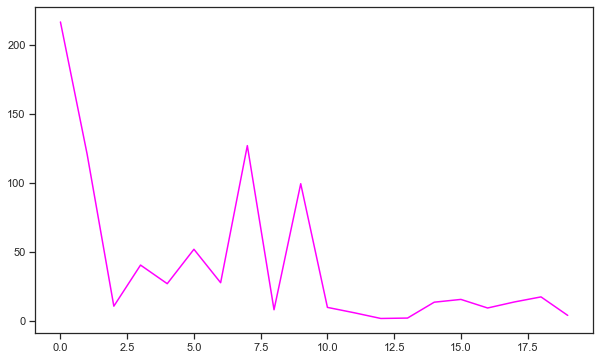
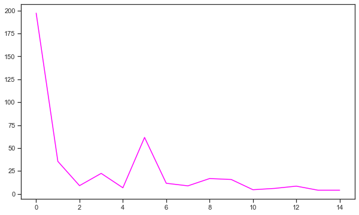

# Named Entity Recognition
The chatbot should also be able, based on the intent, to label entities that it stores in it's dialog management so that it's replies are more accurate. This notebook is where for every Tweet, I try to extract the entities. This should be added to my pipeline later.

More particularly, from the utterance as input, I want the output to be all the entities in that utterance stored in a dictionary.


```python
# Data science
import pandas as pd
print(f"Pandas: {pd.__version__}")
import numpy as np
print(f"Numpy: {np.__version__}")

# Deep Learning 
import tensorflow as tf
print(f"Tensorflow: {tf.__version__}")
from tensorflow import keras
print(f"Keras: {keras.__version__}")
import sklearn
print(f"Sklearn: {sklearn.__version__}")

# NER
import spacy
print(f'spaCy: {spacy.__version__}')
from spacy import displacy
import random
from spacy.matcher import PhraseMatcher
import plac
from pathlib import Path

# Visualization 
import seaborn as sns
import matplotlib.pyplot as plt
sns.set(style="ticks", color_codes=True)

# Cool progress bars
from tqdm import tqdm_notebook as tqdm
tqdm().pandas()  # Enable tracking of execution progress

import collections
import yaml

# Reading back in intents
with open(r'objects/intents.yml') as file:
    intents = yaml.load(file, Loader=yaml.FullLoader)

# Reading in representative intents
# with open(r'objects/intents_repr.yml') as file:
#     intents_repr = yaml.load(file, Loader=yaml.FullLoader)

# Cool progress bars
from tqdm import tqdm_notebook as tqdm
tqdm().pandas()  # Enable tracking of execution progress

from IPython.core.display import display, HTML
    
# Reading in training data
train = pd.read_pickle('objects/train.pkl')

print(train.head())
print(f'\nintents:\n{intents}')

# Reading in processed data
processed = pd.read_pickle('objects/processed.pkl')
```

    Pandas: 1.0.5
    Numpy: 1.18.5
    Tensorflow: 2.2.0
    Keras: 2.3.0-tf
    Sklearn: 0.23.1
    spaCy: 2.3.0


    /opt/anaconda3/envs/chatbot/lib/python3.7/site-packages/ipykernel_launcher.py:31: TqdmDeprecationWarning: This function will be removed in tqdm==5.0.0
    Please use `tqdm.notebook.tqdm` instead of `tqdm.tqdm_notebook`


    HBox(children=(FloatProgress(value=1.0, bar_style='info', max=1.0), HTML(value='')))


    


    /opt/anaconda3/envs/chatbot/lib/python3.7/site-packages/tqdm/std.py:668: FutureWarning: The Panel class is removed from pandas. Accessing it from the top-level namespace will also be removed in the next version
      from pandas import Panel
    /opt/anaconda3/envs/chatbot/lib/python3.7/site-packages/ipykernel_launcher.py:46: TqdmDeprecationWarning: This function will be removed in tqdm==5.0.0
    Please use `tqdm.notebook.tqdm` instead of `tqdm.tqdm_notebook`


    HBox(children=(FloatProgress(value=1.0, bar_style='info', max=1.0), HTML(value='')))


    
                                               Utterance           Intent
    0         [update, io, battery, drain, super, quick]          battery
    1  [thing, try, send, email, domain, domain, neve...  forgot_password
    2  [download, apps, without, add, credit, card, o...          payment
    3  [anyone, else, find, promise, fails, deliver, ...           repair
    4  [since, upgrade, phone, io, constantly, freeze...           update
    
    intents:
    {'battery': ['battery', 'power'], 'forgot_password': ['password', 'account', 'login'], 'lost_replace': ['replace', 'lost', 'gone', 'missing', 'trade', 'trade-in'], 'payment': ['credit', 'card', 'payment', 'pay'], 'repair': ['repair', 'fix', 'broken'], 'update': ['update']}


# Entities to Label:


In actuality, I think a string search with Regex would suffice because there isn't a lot of entities I am looking for. CRF is just a more robust way of doing NER, and would work on corpuses that are too large to really be enumerating all the rules.

# NER Methods

Named Entities are just real world objects that are assigned a name. This is often seen as a sequential prediction problem.

# Making A Customer Apple Related NER
   
I will be making my own custom entities. CRF or Rasa's DIET Classifier is good for this. Almost every chatbot will have some custom entities.

## Conditional Random Field


If I were to use CRFs for training, this is the formula I would apply:


* Here, y is predefined labels
* X is the set of input vectors
* CRFs use contextual information to add to the model
* Z(X) is normalization
* Lambda are the weights

## SpaCy
However, instead of CRF, which is what the RASA bot uses, I use spaCy's NER training because it is better for pretraining and it also has good capability to custom train your data.
    
    (docs) spaCy features an extremely fast statistical entity recognition system, that assigns labels to contiguous spans of tokens. The default model identifies a variety of named and numeric entities, including companies, locations, organizations and products. You can add arbitrary classes to the entity recognition system, and update the model with new examples.
    
To be honest, the documentation isn't the best and it's quite confusing. But I figured it out.

### <font color='red'>My approach and procedure:</font> 
In order to do a custom training (I have my own entities I want to train - namely hardware and application), here was **my procedure**:

1. Enumerated all the entities that I want to identify, then I thought of all the keywords that should be in that entity (I stored this in a `entities` dictionary)
2. Used spaCy's PhraseMatcher to identify where my keywords are in a document - PhraseMatcher is a new addition in spaCy 2.0 that allows you to efficiently do matching with a list of documents
3. Made an offset function that converted the string indexes PhraseMatcher returned into character indexes, because this is how spaCy's recognition trainer accepts the data
4. Further prepared the data to make it a tuple that spaCy recognizer accepts
5. Took just the Tweets from my processed data that contained an entity keyword and trained it with stochastic gradient descent using `nlp.update` and spaCy's NER pipe
6. Repeated for all the entities I want to custom train, otherwise for the location entity I could just use 

### Sources:
* [Training my own custom NER model](https://towardsdatascience.com/custom-named-entity-recognition-using-spacy-7140ebbb3718)
* [NER Using CRF](https://medium.com/data-science-in-your-pocket/named-entity-recognition-ner-using-conditional-random-fields-in-nlp-3660df22e95c)
* [CRF NER with Python AI Time Journal](https://www.aitimejournal.com/@akshay.chavan/complete-tutorial-on-named-entity-recognition-ner-using-python-and-keras)
    * [His Git Repo](https://github.com/Akshayc1/named-entity-recognition)
* [Rasa Entity Extraction Docs](https://rasa.com/docs/rasa/nlu/entity-extraction/)
* [Apple Tagging](https://heartbeat.fritz.ai/natural-language-in-ios-12-customizing-tag-schemes-and-named-entity-recognition-caf2da388a9f) - This guy did what I want to do, but it's super verbose
* [Tagging schemes or types](https://natural-language-understanding.fandom.com/wiki/Named_entity_recognition)
* I got most of the code and understanding of it from [this video](https://www.youtube.com/watch?v=UxzyD6gVlC8&t=1056s)

### Schemes:
* **BIO scheme** (Beginning, Inside, Outside)
* **BILOU scheme** is more rigorous, but requires more training examples.

B is the first token of a multitoken entity, I is the token other than the first one in a multitoken entity, and O represents non-entity tokens.

### Future methods that might improve accuracy:
* Linear Chain Conditional Random Fields (Linear Chain CRF)
* Maximum Entropy Markov Models
* Bidirectional-LSTM


```python
# Looks like I have to make my own training data

entities = {'hardware': ['macbook pro', 'iphone', 'iphones', 'mac',
        'ipad', 'watch', 'TV', 'airpods'],
    'apps':['app store', 'garageband', 'books', 'calendar',
           'podcasts', 'notes', 'icloud', 'music', 'messages',
           'facetime','catalina','maverick'] }
```

# Training Data Synthesis


```python
# Utility function - converts the output of the PrhaseMatcher to something usable in training

def offsetter(lbl, doc, matchitem):
    ''' Converts word position to string position, because output of PhraseMatcher returns  '''
    one = len(str(doc[0:matchitem[1]]))
    subdoc = doc[matchitem[1]:matchitem[2]]
    two = one + len(str(subdoc))
    
    # This function was misaligned by a factor of one character, not sure why, but
    # this is my solution
    if one != 0:
        one += 1
        two += 1
    return (one, two, lbl)

# Example
offsetter('HARDWARE', nlp('hmm macbooks are great'),(2271554079456360229, 1, 2))
```


    (4, 12, 'HARDWARE')


Very convenient! Now we have the string index as opposed to the word index that is automatically outputted from PhraseMatcher. My manual fix also ended up working, so that's good.


```python
# Load spaCy
nlp = spacy.load('en')

# Making sure ner pipe is inside
if 'ner' not in nlp.pipe_names:
    ner = nlp.create_pipe('ner')
    nlp.add_pipe(ner)
else:
    ner = nlp.create_pipe('ner')

def spacify_row(document, label, entity_keywords):
    ''' Transforming a row to get it from a format of my current training data a
    format that spaCy can understand. It's quite combersome that spaCy only accepts data in this very particular format,
    but that is alright.
    '''
    # Phrase matcher - we use this class from spaCy to locate the text we want to label!
    matcher = PhraseMatcher(nlp.vocab)

    # Getting all the hardwares, and the context of how they were used in the Twitter data
    for i in entity_keywords:
        matcher.add(label, None, nlp(i))

    # Getting the matches
    nlp_document = nlp(document)
    matches = matcher(nlp_document)
    
    # Print this if  you want to get a better understanding of this function
#     print([match for match in matches])

    # As you can see, match returns me: [(2271554079456360229, 0, 1)]
    # One match is where one of the tokens in the document matches one of my entity keywords
    # (representiiation of label we passed in, word position in document 1, word position 2)
    entity_list = [offsetter(label, nlp_document, match) for match in matches]
    
    # This is what one row has to look like, so this is what I return:
    # ('what is the price of pool?', {'entities': [(21, 25, 'PrdName')]})
    return (document, {'entities': entity_list})
```

### Hardware Entity


```python
# Defining my training data
string_utterance = train['Utterance'].progress_apply(" ".join)

# Trying for one row
spacify_row('I love my macbook and my iphone', 'HARDWARE', 
            entity_keywords = entities.get('hardware'))
```


    HBox(children=(FloatProgress(value=0.0, max=9000.0), HTML(value='')))


    


    ('I love my macbook and my iphone', {'entities': [(25, 31, 'HARDWARE')]})


Great, here we see that the NER recognized `macbooks` and `iphone`, and gave their relative word positions. Now let's apply this to our entire training data.


```python
# Getting training data by 'spacifying' my processed Twitter data and storing it in an object
entity_train = string_utterance.progress_apply(spacify_row,
                label = 'HARDWARE',              
                entity_keywords = entities.get('hardware'))
```


    HBox(children=(FloatProgress(value=0.0, max=9000.0), HTML(value='')))


    


```python
# Filtering out if the Tweet does not contain any of the entities
hardware_train = [(i,j) for i,j in entity_train if j['entities'] != []]

# We will be using hardware train to train the recognizer
print(f'{len(hardware_train)} out of {len(entity_train)} Tweets contain a hardware entity')
```

    1585 out of 9000 Tweets contain a hardware entity


### Application Entity


```python
# Doing the same for my applications
entity_train = string_utterance.progress_apply(spacify_row,
                label = 'APP',              
                entity_keywords = entities.get('apps'))

# Filtering out if the Tweet does not contain any of the entities
app_train = [(i,j) for i,j in entity_train if j['entities'] != []]

# We will be using hardware train to train the recognizer
print(f'{len(app_train)} out of {len(entity_train)} Tweets contain an app entity')
```


    HBox(children=(FloatProgress(value=0.0, max=9000.0), HTML(value='')))


    
    355 out of 9000 Tweets contain a hardware entity


```python
# Preview 
hardware_train[:5]
```


    [('omg upgrade iphone new io joke everything crash',
      {'entities': [(12, 18, 'HARDWARE')]}),
     ('like iphone battery replace mine perform well do day location',
      {'entities': [(5, 11, 'HARDWARE')]}),
     ('iphone run battery life fine instal io software update life get bad',
      {'entities': [(0, 6, 'HARDWARE')]}),
     ('since upgrade io iphone everything slow apps crash every minute',
      {'entities': [(17, 23, 'HARDWARE')]}),
     ('you all fix sd slot mac book piece broke',
      {'entities': [(20, 23, 'HARDWARE')]})]


```python
# Preview
app_train[:5]
```


    [('thing try send email domain domain never reach destiny icloud direction kind restriction know',
      {'entities': [(55, 61, 'APP')]}),
     ('hi access apple music ask chose payment plan already register',
      {'entities': [(16, 21, 'APP')]}),
     ('use apple pay update icloud billing', {'entities': [(21, 27, 'APP')]}),
     ('hii update phone apple music work see song download purchase one itunes pls sort pay',
      {'entities': [(23, 28, 'APP')]}),
     ('add itunes gift card still can not download apps pay student apple music account',
      {'entities': [(67, 72, 'APP')]})]


Nice, this is the correct format. For the character level position indexes, the right is inclusive, and the left is a space/exclusive.

# Training the Recognizer with SGD


```python
# Now we train the recognizer. 
def train_spacy(train_data, iterations):
    nlp = spacy.blank('en')  # create blank Language class
    # create the built-in pipeline components and add them to the pipeline
    # nlp.create_pipe works for built-ins that are registered with spaCy
    if 'ner' not in nlp.pipe_names:
        ner = nlp.create_pipe('ner')
        nlp.add_pipe(ner, last=True)
       
    # Add labels
    for _, annotations in train_data:
         for ent in annotations.get('entities'):
            ner.add_label(ent[2])

    # Disable all pipes other than 'ner' during training
    other_pipes = [pipe for pipe in nlp.pipe_names if pipe != 'ner']
    with nlp.disable_pipes(*other_pipes):  # only train NER
        optimizer = nlp.begin_training()
        
        train_loss = []
        
        # Go through the training data N times
        for itn in range(iterations):
            print("Starting iteration " + str(itn))
            
            # Shuffle training data
            random.shuffle(train_data)
            
            # Iteration level metrics
            losses = {}
            misalligned_count = 0
            
            # Iterating through every Tweet
            for text, annotations in train_data:    
                try:
                    nlp.update(
                        [text],  # batch of texts
                        [annotations],  # batch of annotations
                        drop=0.2,  # dropout - make it harder to memorise data
                        sgd=optimizer,  # callable to update weights
                        losses=losses)
                except ValueError as e:
                    misalligned_count += 1
                    # If it goes here, that means there's a misaligned entity
                    print(f'Ignoring misaligned entity...\n{(text,annotations)}')
                    pass
                
            # Enable this is you want to track misalliged counts
#             print(f'-- misalligned_count (iteration {itn}): {misalligned_count}')
            # Documenting the loss
            train_loss.append(losses.get('ner'))
            print(f'losses (iteration {itn}): {losses}')
            
        # Visualizing the loss
        plt.figure(figsize=(10,6))
        plt.plot([*range(len(train_loss))], train_loss, color = 'magenta')
        plt.title('Loss at every iteration')
        plt.xlabel('Iteration Number')
        plt.ylabel('Loss')
        plt.show()
            
    return nlp

# Error rate is going up for the minimum for the path we are currently walking in
# We choose 20 for iterations, but there's a point where if you do it too many times it forgets the
# stuff it knows now
```


```python
[*range(10)]
```


    [0, 1, 2, 3, 4, 5, 6, 7, 8, 9]


Misalligned means that `macbook` and `macbook pro` are both identified, as an example, and they overlap or fight for the same position.

### Training

For the number of iterations, we chose 20 because that's what the docs started with, but there's a point where if you iterate too many times it forgets the stuff it knows how already (catostrophic forgetting).


```python
# Training
hardware_nlp = train_spacy(hardware_train, 20)

# Save our trained model into a new directory
hardware_nlp.to_disk('models/hardware_nlp')
```

    Starting iteration 0
    losses (iteration 0): {'ner': 216.33854159096512}
    Starting iteration 1
    losses (iteration 1): {'ner': 120.60770595770774}
    Starting iteration 2
    losses (iteration 2): {'ner': 10.61177587233007}
    Starting iteration 3
    losses (iteration 3): {'ner': 40.36325370954146}
    Starting iteration 4
    losses (iteration 4): {'ner': 26.88752356218749}
    Starting iteration 5
    losses (iteration 5): {'ner': 51.800128262884215}
    Starting iteration 6
    losses (iteration 6): {'ner': 27.597945382277803}
    Starting iteration 7
    losses (iteration 7): {'ner': 126.82781082216367}
    Starting iteration 8
    losses (iteration 8): {'ner': 8.017834203238847}
    Starting iteration 9
    losses (iteration 9): {'ner': 99.25530528355954}
    Starting iteration 10
    losses (iteration 10): {'ner': 9.735439018664588}
    Starting iteration 11
    losses (iteration 11): {'ner': 5.8609973933198205}
    Starting iteration 12
    losses (iteration 12): {'ner': 1.709985985506379}
    Starting iteration 13
    losses (iteration 13): {'ner': 2.006430732526952}
    Starting iteration 14
    losses (iteration 14): {'ner': 13.494028001580139}
    Starting iteration 15
    losses (iteration 15): {'ner': 15.50610016837338}
    Starting iteration 16
    losses (iteration 16): {'ner': 9.294663171618208}
    Starting iteration 17
    losses (iteration 17): {'ner': 13.650915962813587}
    Starting iteration 18
    losses (iteration 18): {'ner': 17.33064979711227}
    Starting iteration 19
    losses (iteration 19): {'ner': 3.9405504874687676}





Training seems to do fine. Error rate is going up for the minimum for the path we are currently walking in.


```python
# Training (reduced iterations because less data)
app_nlp = train_spacy(app_train, 15)

# Save our trained model into a new directory
app_nlp.to_disk('models/app_nlp')
```

    /opt/anaconda3/envs/chatbot/lib/python3.7/site-packages/spacy/language.py:636: UserWarning: [W033] Training a new parser or NER using a model with no lexeme normalization table. This may degrade the performance of the model to some degree. If this is intentional or the language you're using doesn't have a normalization table, please ignore this warning. If this is surprising, make sure you have the spacy-lookups-data package installed. The languages with lexeme normalization tables are currently: da, de, el, en, id, lb, pt, ru, sr, ta, th.
      **kwargs


    Starting iteration 0


    /opt/anaconda3/envs/chatbot/lib/python3.7/site-packages/spacy/language.py:479: UserWarning: [W030] Some entities could not be aligned in the text "hey problem iphone run io activate phone number im..." with entities "[(58, 66, 'APP')]". Use `spacy.gold.biluo_tags_from_offsets(nlp.make_doc(text), entities)` to check the alignment. Misaligned entities ('-') will be ignored during training.
      gold = GoldParse(doc, **gold)


    losses (iteration 0): {'ner': 197.27756789558754}
    Starting iteration 1
    losses (iteration 1): {'ner': 35.46891294988121}
    Starting iteration 2
    losses (iteration 2): {'ner': 8.961724374840625}
    Starting iteration 3
    losses (iteration 3): {'ner': 22.356722515710196}
    Starting iteration 4
    losses (iteration 4): {'ner': 6.645385392452065}
    Starting iteration 5
    losses (iteration 5): {'ner': 61.59501345488182}
    Starting iteration 6
    losses (iteration 6): {'ner': 11.56768289962519}
    Starting iteration 7
    losses (iteration 7): {'ner': 8.752651775984003}
    Starting iteration 8
    losses (iteration 8): {'ner': 16.709664168365403}
    Starting iteration 9
    losses (iteration 9): {'ner': 15.68114516859695}
    Starting iteration 10
    losses (iteration 10): {'ner': 4.510681477667537}
    Starting iteration 11
    losses (iteration 11): {'ner': 5.975828508382952}
    Starting iteration 12
    losses (iteration 12): {'ner': 8.429807408224903}
    Starting iteration 13
    losses (iteration 13): {'ner': 3.9990337655891612}
    Starting iteration 14
    losses (iteration 14): {'ner': 4.004075679241166}





# Evaluation and Results


```python
# Read our trained model back in
hardware_nlp.from_disk('models/hardware_nlp')

# Testing out the results
test_text = 'My iphone sucks but my macbook pro doesnt. Why couldnt they make\
            my iphone better. At least I could use airpods with it. Mcabook pro is\
            the best! Apple watches too. Maybe if they made the iphone more like the\
            ipad or my TV it would be alright. Mac. Ugh.'

doc = hardware_nlp(test_text)

# These are the objects you can take out
# for ent in doc.ents:
#     print(ent.text, ent.start_char, ent.end_char, ent.label_)
    
# Visualizing with displaCy how the document had it's entity tagged (runs a server)
colors = {"HARDWARE": "linear-gradient(90deg, #aa9cfc, #fc9ce7)"}
options = {"ents": ["HARDWARE"], "colors": colors}

html = displacy.render(doc, style = 'ent', options = options)
display(HTML(html));
# displacy.serve(doc, style="ent", options=options)
# displacy.serve(doc, style="ent")
```


<span class="tex2jax_ignore"><div class="entities" style="line-height: 2.5; direction: ltr">My 
<mark class="entity" style="background: linear-gradient(90deg, #aa9cfc, #fc9ce7); padding: 0.45em 0.6em; margin: 0 0.25em; line-height: 1; border-radius: 0.35em;">
    iphone
    <span style="font-size: 0.8em; font-weight: bold; line-height: 1; border-radius: 0.35em; text-transform: uppercase; vertical-align: middle; margin-left: 0.5rem">HARDWARE</span>
</mark>
 sucks but my 
<mark class="entity" style="background: linear-gradient(90deg, #aa9cfc, #fc9ce7); padding: 0.45em 0.6em; margin: 0 0.25em; line-height: 1; border-radius: 0.35em;">
    macbook pro
    <span style="font-size: 0.8em; font-weight: bold; line-height: 1; border-radius: 0.35em; text-transform: uppercase; vertical-align: middle; margin-left: 0.5rem">HARDWARE</span>
</mark>
 doesnt. Why couldnt they make            my 
<mark class="entity" style="background: linear-gradient(90deg, #aa9cfc, #fc9ce7); padding: 0.45em 0.6em; margin: 0 0.25em; line-height: 1; border-radius: 0.35em;">
    iphone
    <span style="font-size: 0.8em; font-weight: bold; line-height: 1; border-radius: 0.35em; text-transform: uppercase; vertical-align: middle; margin-left: 0.5rem">HARDWARE</span>
</mark>
 better. At least I could use 
<mark class="entity" style="background: linear-gradient(90deg, #aa9cfc, #fc9ce7); padding: 0.45em 0.6em; margin: 0 0.25em; line-height: 1; border-radius: 0.35em;">
    airpods
    <span style="font-size: 0.8em; font-weight: bold; line-height: 1; border-radius: 0.35em; text-transform: uppercase; vertical-align: middle; margin-left: 0.5rem">HARDWARE</span>
</mark>
 with it. 
<mark class="entity" style="background: linear-gradient(90deg, #aa9cfc, #fc9ce7); padding: 0.45em 0.6em; margin: 0 0.25em; line-height: 1; border-radius: 0.35em;">
    Mcabook pro
    <span style="font-size: 0.8em; font-weight: bold; line-height: 1; border-radius: 0.35em; text-transform: uppercase; vertical-align: middle; margin-left: 0.5rem">HARDWARE</span>
</mark>
 is            the best! Apple watches too. Maybe if they made the 
<mark class="entity" style="background: linear-gradient(90deg, #aa9cfc, #fc9ce7); padding: 0.45em 0.6em; margin: 0 0.25em; line-height: 1; border-radius: 0.35em;">
    iphone
    <span style="font-size: 0.8em; font-weight: bold; line-height: 1; border-radius: 0.35em; text-transform: uppercase; vertical-align: middle; margin-left: 0.5rem">HARDWARE</span>
</mark>
 more like the            
<mark class="entity" style="background: linear-gradient(90deg, #aa9cfc, #fc9ce7); padding: 0.45em 0.6em; margin: 0 0.25em; line-height: 1; border-radius: 0.35em;">
    ipad
    <span style="font-size: 0.8em; font-weight: bold; line-height: 1; border-radius: 0.35em; text-transform: uppercase; vertical-align: middle; margin-left: 0.5rem">HARDWARE</span>
</mark>
 or my TV it would be alright. 
<mark class="entity" style="background: linear-gradient(90deg, #aa9cfc, #fc9ce7); padding: 0.45em 0.6em; margin: 0 0.25em; line-height: 1; border-radius: 0.35em;">
    Mac
    <span style="font-size: 0.8em; font-weight: bold; line-height: 1; border-radius: 0.35em; text-transform: uppercase; vertical-align: middle; margin-left: 0.5rem">HARDWARE</span>
</mark>
. Ugh.</div></span>


    <IPython.core.display.HTML object>


As demoed above, the model actually does quite a good job labelling the entities! The only false positive is Why, but that could be dealt with.


```python
# Viewing the pipeline's contents
hardware_nlp.pipeline
```


    [('ner', <spacy.pipeline.pipes.EntityRecognizer at 0x196101fe50>)]


```python
entities
```


    {'hardware': ['macbook pro',
      'iphone',
      'iphones',
      'mac',
      'ipad',
      'watch',
      'TV',
      'airpods'],
     'apps': ['app store',
      'garageband',
      'books',
      'calendar',
      'podcasts',
      'notes',
      'icloud',
      'music',
      'messages',
      'facetime',
      'catalina',
      'maverick']}


```python

```


```python

```


```python

```


```python

```


```python

```


```python

```


```python

```


```python
# Training my own model that would be able to extract entities from text

nlp = spacy.load("en_core_web_sm")
doc = nlp("But Google is starting from behind. The company made a late push\ninto hardware, and Apple’s Siri, available on iPhones, and Amazon’s Alexa\nsoftware, which runs on its Echo and Dot devices, have clear leads in\nconsumer adoption")

for ent in doc.ents:
    print(ent.text, ent.start_char, ent.end_char, ent.label_)

# Visualizing with displaCy how the document had it's entity tagged
# html = displacy.serve(doc, style="ent")
html = displacy.render(doc, style = 'ent')
display(HTML(html))
```

    Google 4 10 ORG
    Apple 84 89 ORG
    Siri 92 96 NORP
    iPhones 111 118 ORG
    Amazon 124 130 ORG
    Echo 167 171 LOC
    Dot 176 179 ORG


<span class="tex2jax_ignore"><!DOCTYPE html>
<html lang="en">
    <head>
        <title>displaCy</title>
    </head>

    <body style="font-size: 16px; font-family: -apple-system, BlinkMacSystemFont, 'Segoe UI', Helvetica, Arial, sans-serif, 'Apple Color Emoji', 'Segoe UI Emoji', 'Segoe UI Symbol'; padding: 4rem 2rem; direction: ltr">
<figure style="margin-bottom: 6rem">
<div class="entities" style="line-height: 2.5; direction: ltr">But 
<mark class="entity" style="background: #7aecec; padding: 0.45em 0.6em; margin: 0 0.25em; line-height: 1; border-radius: 0.35em;">
    Google
    <span style="font-size: 0.8em; font-weight: bold; line-height: 1; border-radius: 0.35em; text-transform: uppercase; vertical-align: middle; margin-left: 0.5rem">ORG</span>
</mark>
 is starting from behind. The company made a late push</br>into hardware, and 
<mark class="entity" style="background: #7aecec; padding: 0.45em 0.6em; margin: 0 0.25em; line-height: 1; border-radius: 0.35em;">
    Apple
    <span style="font-size: 0.8em; font-weight: bold; line-height: 1; border-radius: 0.35em; text-transform: uppercase; vertical-align: middle; margin-left: 0.5rem">ORG</span>
</mark>
’s 
<mark class="entity" style="background: #c887fb; padding: 0.45em 0.6em; margin: 0 0.25em; line-height: 1; border-radius: 0.35em;">
    Siri
    <span style="font-size: 0.8em; font-weight: bold; line-height: 1; border-radius: 0.35em; text-transform: uppercase; vertical-align: middle; margin-left: 0.5rem">NORP</span>
</mark>
, available on 
<mark class="entity" style="background: #7aecec; padding: 0.45em 0.6em; margin: 0 0.25em; line-height: 1; border-radius: 0.35em;">
    iPhones
    <span style="font-size: 0.8em; font-weight: bold; line-height: 1; border-radius: 0.35em; text-transform: uppercase; vertical-align: middle; margin-left: 0.5rem">ORG</span>
</mark>
, and 
<mark class="entity" style="background: #7aecec; padding: 0.45em 0.6em; margin: 0 0.25em; line-height: 1; border-radius: 0.35em;">
    Amazon
    <span style="font-size: 0.8em; font-weight: bold; line-height: 1; border-radius: 0.35em; text-transform: uppercase; vertical-align: middle; margin-left: 0.5rem">ORG</span>
</mark>
’s Alexa</br>software, which runs on its 
<mark class="entity" style="background: #ff9561; padding: 0.45em 0.6em; margin: 0 0.25em; line-height: 1; border-radius: 0.35em;">
    Echo
    <span style="font-size: 0.8em; font-weight: bold; line-height: 1; border-radius: 0.35em; text-transform: uppercase; vertical-align: middle; margin-left: 0.5rem">LOC</span>
</mark>
 and 
<mark class="entity" style="background: #7aecec; padding: 0.45em 0.6em; margin: 0 0.25em; line-height: 1; border-radius: 0.35em;">
    Dot
    <span style="font-size: 0.8em; font-weight: bold; line-height: 1; border-radius: 0.35em; text-transform: uppercase; vertical-align: middle; margin-left: 0.5rem">ORG</span>
</mark>
 devices, have clear leads in
consumer adoption</div>
</figure>
</body>
</html></span>


    
    Using the 'ent' visualizer
    Serving on http://0.0.0.0:5000 ...
    
    Shutting down server on port 5000.


We see that right off the box, spaCy's tool does not recognize iphones, apple phones, as the correct entity. They only understood Apple is an Organization. Therefore, I will try to train it's model to be able to understand it.


```python
# I need to train

```


```python
train
```


```python
import spacy
import random


TRAIN_DATA = [('what is the price of polo?', {'entities': [(21, 25, 'PrdName')]}), 
              ('what is the price of ball?', {'entities': [(21, 25, 'PrdName')]}), 
              ('what is the price of jegging?', {'entities': [(21, 28, 'PrdName')]}), 
              ('what is the price of t-shirt?', {'entities': [(21, 28, 'PrdName')]}), 
              ('what is the price of jeans?', {'entities': [(21, 26, 'PrdName')]}), 
              ('what is the price of bat?', {'entities': [(21, 24, 'PrdName')]}), 
              ('what is the price of shirt?', {'entities': [(21, 26, 'PrdName')]}), 
              ('what is the price of bag?', {'entities': [(21, 24, 'PrdName')]}), 
              ('what is the price of cup?', {'entities': [(21, 24, 'PrdName')]}), 
              ('what is the price of jug?', {'entities': [(21, 24, 'PrdName')]}), 
              ('what is the price of plate?', {'entities': [(21, 26, 'PrdName')]}), 
              ('what is the price of glass?', {'entities': [(21, 26, 'PrdName')]}), 
              ('what is the price of moniter?', {'entities': [(21, 28, 'PrdName')]}), 
              ('what is the price of desktop?', {'entities': [(21, 28, 'PrdName')]}), 
              ('what is the price of bottle?', {'entities': [(21, 27, 'PrdName')]}), 
              ('what is the price of mouse?', {'entities': [(21, 26, 'PrdName')]}), 
              ('what is the price of keyboad?', {'entities': [(21, 28, 'PrdName')]}), 
              ('what is the price of chair?', {'entities': [(21, 26, 'PrdName')]}), 
              ('what is the price of table?', {'entities': [(21, 26, 'PrdName')]}), 
              ('what is the price of watch?', {'entities': [(21, 26, 'PrdName')]})]
```


```python
# Getting my training data
```


```python
def train_spacy(data,iterations):
    TRAIN_DATA = data
    nlp = spacy.blank('en')  # create blank Language class
    # create the built-in pipeline components and add them to the pipeline
    # nlp.create_pipe works for built-ins that are registered with spaCy
    if 'ner' not in nlp.pipe_names:
        ner = nlp.create_pipe('ner')
        nlp.add_pipe(ner, last=True)
       

    # add labels
    for _, annotations in TRAIN_DATA:
         for ent in annotations.get('entities'):
            ner.add_label(ent[2])

    # get names of other pipes to disable them during training
    other_pipes = [pipe for pipe in nlp.pipe_names if pipe != 'ner']
    with nlp.disable_pipes(*other_pipes):  # only train NER
        optimizer = nlp.begin_training()
        for itn in range(iterations):
            print("Starting iteration " + str(itn))
            random.shuffle(TRAIN_DATA)
            losses = {}
            for text, annotations in TRAIN_DATA:
                nlp.update(
                    [text],  # batch of texts
                    [annotations],  # batch of annotations
                    drop=0.2,  # dropout - make it harder to memorise data
                    sgd=optimizer,  # callable to update weights
                    losses=losses)
            print(losses)
    return nlp
```


```python
prdnlp = train_spacy(TRAIN_DATA, 20)

# Save our trained Model
# modelfile = input("Enter your Model Name: ")
# prdnlp.to_disk(modelfile)
```

    /opt/anaconda3/envs/chatbot/lib/python3.7/site-packages/spacy/language.py:636: UserWarning: [W033] Training a new parser or NER using a model with no lexeme normalization table. This may degrade the performance of the model to some degree. If this is intentional or the language you're using doesn't have a normalization table, please ignore this warning. If this is surprising, make sure you have the spacy-lookups-data package installed. The languages with lexeme normalization tables are currently: da, de, el, en, id, lb, pt, ru, sr, ta, th.
      **kwargs


    Statring iteration 0
    {'ner': 45.2139813936883}
    Statring iteration 1
    {'ner': 2.1685341579591877}
    Statring iteration 2
    {'ner': 1.974107676599222}
    Statring iteration 3
    {'ner': 1.8348414352160531}
    Statring iteration 4
    {'ner': 1.6271458928689257}
    Statring iteration 5
    {'ner': 5.468022166482383}
    Statring iteration 6
    {'ner': 2.3358381469519625}
    Statring iteration 7
    {'ner': 1.612697906329859}
    Statring iteration 8
    {'ner': 2.3214056710935655}
    Statring iteration 9
    {'ner': 1.922652965671766}
    Statring iteration 10
    {'ner': 0.4905887081540934}
    Statring iteration 11
    {'ner': 0.004857530282970933}
    Statring iteration 12
    {'ner': 0.000960784972306959}
    Statring iteration 13
    {'ner': 1.179848125136368e-06}
    Statring iteration 14
    {'ner': 3.5997240566462675e-06}
    Statring iteration 15
    {'ner': 2.1539162915786077e-07}
    Statring iteration 16
    {'ner': 4.8670031830564714e-05}
    Statring iteration 17
    {'ner': 1.3474874770466213e-06}
    Statring iteration 18
    {'ner': 1.136783499794667e-06}
    Statring iteration 19
    {'ner': 4.976707030223931e-07}


```python
#Test your text
test_text = 'how much does an iphone cost?'
doc = prdnlp(test_text)
for ent in doc.ents:
    print(ent.text, ent.start_char, ent.end_char, ent.label_)
```

    iphone 17 23 PrdName


# Updating training data
Here I add an `entity` as well to each Tweet in addition to it's intent.


```python
train
```


<div>
<style scoped>
    .dataframe tbody tr th:only-of-type {
        vertical-align: middle;
    }

    .dataframe tbody tr th {
        vertical-align: top;
    }

    .dataframe thead th {
        text-align: right;
    }
</style>
<table border="1" class="dataframe">
  <thead>
    <tr style="text-align: right;">
      <th></th>
      <th>Utterance</th>
      <th>Intent</th>
    </tr>
  </thead>
  <tbody>
    <tr>
      <th>0</th>
      <td>[update, io, battery, drain, super, quick]</td>
      <td>battery</td>
    </tr>
    <tr>
      <th>1</th>
      <td>[thing, try, send, email, domain, domain, neve...</td>
      <td>forgot_password</td>
    </tr>
    <tr>
      <th>2</th>
      <td>[download, apps, without, add, credit, card, o...</td>
      <td>payment</td>
    </tr>
    <tr>
      <th>3</th>
      <td>[anyone, else, find, promise, fails, deliver, ...</td>
      <td>repair</td>
    </tr>
    <tr>
      <th>4</th>
      <td>[since, upgrade, phone, io, constantly, freeze...</td>
      <td>update</td>
    </tr>
    <tr>
      <th>...</th>
      <td>...</td>
      <td>...</td>
    </tr>
    <tr>
      <th>8995</th>
      <td>[please, advise, iphone, battery, dy, half, da...</td>
      <td>update</td>
    </tr>
    <tr>
      <th>8996</th>
      <td>[talk, human, please]</td>
      <td>speak_representative</td>
    </tr>
    <tr>
      <th>8997</th>
      <td>[good, morning]</td>
      <td>greeting</td>
    </tr>
    <tr>
      <th>8998</th>
      <td>[done]</td>
      <td>goodbye</td>
    </tr>
    <tr>
      <th>8999</th>
      <td>[robot, human]</td>
      <td>challenge_robot</td>
    </tr>
  </tbody>
</table>
<p>9000 rows × 2 columns</p>
</div>


```python

```
